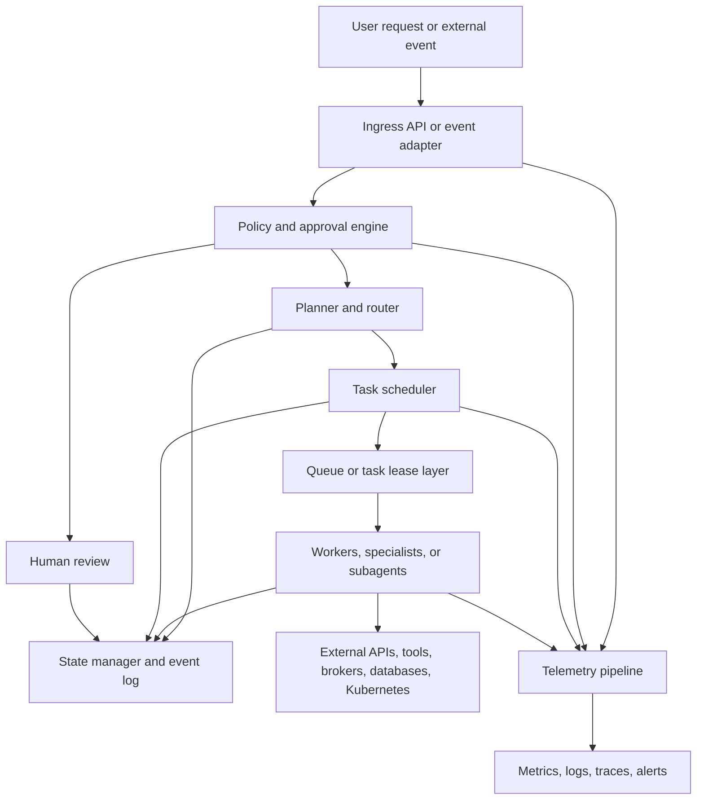
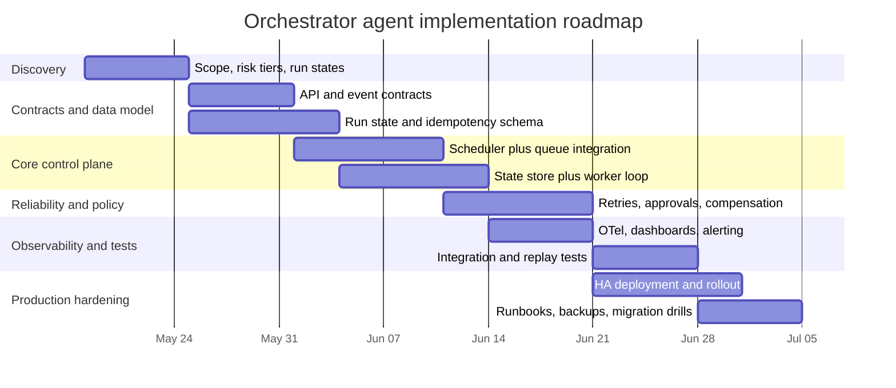

# Building an Orchestrator Agent

## Executive summary

**Assumption.** No programming language or cloud provider was specified, so this report is language-agnostic and cloud-neutral. Where an example depends on a particular ecosystem, I call that out explicitly.

An orchestrator agent is best treated as a **control plane**, not as “just another agent.” In production, the orchestrator should own goal decomposition, routing, durable state, policy checks, approvals, retries, auditability, and completion criteria; specialized workers, tools, or subagents should own bounded domain work. That framing aligns with current agent guidance emphasizing explicit orchestration, tool contracts, guardrails, and stateful multistep execution rather than unconstrained autonomy. citeturn21search15turn21search3turn21search10turn21search0

The strongest default architecture for a greenfield system is a **centralized manager-worker topology** with explicit tool/service contracts, a durable state store, a queue or task-lease mechanism, and built-in guardrails. Add remote handoffs or multi-agent federation only when ownership truly changes or when independently deployed agents must collaborate across organizational or technical boundaries. Recent guidance strongly favors starting with simple, transparent patterns and adding specialization only when it measurably improves outcomes. citeturn21search3turn21search11turn21search12turn21search10

The substrate should be chosen by the **failure model and state model**, not by fashion. If work must survive process crashes, node failures, long waits, human approval steps, or business compensation logic, durable workflow engines such as Temporal are the strongest fit. If the primary problem is Kubernetes-native desired-state reconciliation or containerized batch DAGs, Kubernetes operators and Argo Workflows are stronger. If the dominant problem is data and asset orchestration, Airflow, Dagster, and Prefect are better fits. If the problem is lightweight asynchronous background execution, Celery is usually enough. If the core problem is dynamic distributed compute with resource-aware scheduling and stateful workers, Ray is the natural substrate. citeturn2search18turn2search24turn1search1turn20search20turn4search0turn17search12turn8search3turn3search20turn6search20

The non-negotiables for a production orchestrator are **explicit durable state**, **idempotent side effects**, **policy gating**, and **observability**. Official docs across Temporal, Airflow, Argo, Dagster, Prefect, Celery, and Ray all assume retries, replay, or redelivery in some form, which means business actions must be safe to re-run or compensate. Similarly, modern platforms increasingly expect traces, metrics, logs, and health checks as first-class operational interfaces. citeturn27search9turn27search0turn20search12turn20search1turn20search7turn9search1turn3search19turn24search4turn24search17turn24search2turn24search3

If I had to recommend a cloud-neutral default stack for a custom orchestrator, the shortest path is: **PostgreSQL for metadata/state, gRPC or REST/OpenAPI for control APIs, CloudEvents over Kafka or NATS for asynchronous events, OpenTelemetry for telemetry, SPIFFE/Istio or equivalent for workload identity and mTLS, Vault or equivalent for secrets, and Kubernetes for deployment**. If workflows must be durably resumable over long horizons, replace most custom durability logic with Temporal rather than rebuilding it yourself. This last point is an engineering inference from the operational patterns in the official docs, not a vendor slogan. citeturn19search3turn10search11turn10search6turn10search3turn26search9turn11search1turn10search4turn12search13turn11search2turn12search10turn14search8turn2search18

Priority source stack used most heavily here: urlTemporal docsturn2search5, urlKubernetes controller and operator docsturn1search1, urlApache Airflow docsturn4search14, urlArgo Workflows docsturn5search16, urlCelery docsturn3search20, urlRay docsturn6search20, urlDagster docsturn17search12, urlPrefect docsturn8search3, and the protocol and standards docs cited inline below. The most decision-shaping cross-cutting guidance came from entity["company","OpenAI","ai company"]’s urlagent-building guidanceturn21search12, entity["company","Anthropic","ai company"]’s urleffective-agents guidanceturn21search10, and entity["organization","NIST","us standards body"]’s urlcloud-native zero-trust guidanceturn12search8. citeturn21search12turn21search10turn12search8

## Definitions and scope

For this report, an **orchestrator agent** is a service that accepts a goal or event, decides what should happen next, selects who or what should do it, maintains execution state over time, enforces policy, and supervises the run until it reaches a terminal state. That definition intentionally combines three ideas that appear separately in the official material: the modern agent notion of “plan + tools + state,” the Kubernetes notion of a control loop driving actual state toward desired state, and the durable-workflow notion of fault-tolerant long-lived execution. citeturn21search15turn1search9turn2search8turn2search18

That definition excludes some adjacent systems. A single tool-calling assistant without durable state, scheduling, or supervision is usually **not** an orchestrator agent. A bare task queue or worker farm is an **execution substrate**, not a full orchestrator, unless it also maintains workflow state, applies policy, and drives decisions. By contrast, a Kubernetes operator **does** count as an orchestrator agent when it watches desired state, reconciles resources, updates status, retries, and converges the world toward a declared objective. A workflow engine becomes agentic when it is used not only for static DAG scheduling but also for dynamic routing, tool selection, approvals, and adaptive execution. citeturn1search1turn7search20turn3search20turn21search15

A useful scope test is whether the system has all of the following: a routable **task graph**, a **state model**, a **policy surface**, a **communication contract**, and an operational story for **recovery and observability**. If any of those are missing, the system may still be valuable, but it is better described as a scheduler, worker runtime, tool wrapper, or controller rather than a complete orchestrator agent. citeturn4search0turn20search17turn2search1turn21search0turn10search4

Practically, most orchestrator agents fall into one of four families. First, **workflow orchestrators** coordinate explicit task graphs and dependencies. Second, **queue orchestrators** dispatch and supervise asynchronous work. Third, **reconcilers/operators** continuously converge a system toward desired state. Fourth, **LLM supervisors** plan, call tools, and delegate bounded tasks to specialized workers or agents. Mature systems frequently combine these families rather than choosing only one. citeturn4search0turn3search20turn1search9turn21search3

## Architectures and design patterns

The most robust baseline pattern is a **centralized manager-worker system**. The manager receives goals, checks policy, decomposes work, records state, and dispatches tasks. Workers or specialists execute bounded operations and report results. This is close to the “agents as tools” pattern in the OpenAI orchestration guide: the central agent retains final responsibility and calls specialists as helpers instead of transferring ownership. This structure is easier to debug, easier to secure, and easier to make auditable than a free-form swarm. citeturn21search3turn16search2turn21search17

The next pattern is **handoffs or federated specialists**. Here, the orchestrator deliberately transfers ownership to another agent or subsystem because the contract, risk boundary, or domain has changed. That is appropriate when different agents are independently deployed, separately governed, or optimized for very different tasks. It is not the best first move for a new system because handoffs multiply interfaces, failure modes, and observational blind spots. citeturn21search3turn13search5turn13search13

A third pattern is **durable execution**, where the workflow itself is the durable unit of control. Temporal is the clearest representative: the platform persists event history, distributes tasks through task queues, and replays workflow code after failures. This is especially strong for long-running business processes, timers, approvals, and compensation logic because the persistence model is built into the orchestration substrate rather than bolted on afterward. citeturn2search1turn2search2turn2search7turn2search18

A fourth pattern is the **reconciliation loop** used by Kubernetes controllers and operators. A controller watches the world, compares desired state with observed state, and repeatedly reconciles until they match. This pattern is simpler than it looks and extremely powerful for infrastructure, platform automation, and resource lifecycle management. It is the best fit when “desired vs observed state” is more central than “ordered business process.” citeturn1search9turn1search5turn7search20

A fifth pattern is **DAG orchestration**, used by Airflow, Argo Workflows, Dagster, and Prefect. DAG-oriented systems excel when the work is mostly explicit, dependency-driven, batch-oriented, or data-centric. They are often easier to inspect and reason about than fully dynamic agent systems, especially when schedules, dependencies, and run histories are part of the product’s core requirements. citeturn4search0turn0search5turn17search12turn8search3

A sixth pattern is the **queue-and-actor runtime** represented by Celery and Ray. Celery is queue-first and ideal when work is asynchronous, Python-heavy, and operationally simple. Ray adds a richer runtime: tasks, stateful actors, object store semantics, and resource-aware scheduling. Ray is often the more natural choice when an orchestrator agent needs dynamic fan-out, locality-aware placement, gang scheduling, or stateful workers that behave more like services than one-off jobs. citeturn3search20turn6search8turn22search3turn22search7

A common mistake is to put too much “orchestration intelligence” inside the model itself. Recent guidance explicitly argues the opposite: orchestration logic such as loops, conditionals, retries, transformations, and approvals belongs in code, while the model is better used for bounded decisions such as classification, planning suggestions, extraction, or tool argument construction. citeturn21search14turn21search10turn21search12

The architecture below is the most broadly applicable reference design for a production orchestrator agent. It is a synthesis of the durable execution, controller, queue, and observability patterns in the official docs. citeturn2search2turn1search9turn10search4turn21search3



## Core components

### Task scheduler

The scheduler decides **what is runnable now**, under which constraints, and on which execution substrate. In practice, that means dependency resolution, priority, concurrency limits, rate limits, deadlines, and backpressure. Airflow exposes pools, DAG concurrency, and priority weights; Argo exposes controller-level parallelism, namespace parallelism, mutexes, and semaphores; Prefect exposes work pools, work queues, and global concurrency limits; Temporal exposes task queues, partitions, and emerging priority/fairness controls; Ray exposes resource-aware scheduling and placement groups. An orchestrator agent does not need every one of these mechanisms on day one, but it does need a coherent admission-control story. citeturn22search0turn22search4turn5search2turn5search6turn22search1turn22search2turn22search10turn22search3turn22search7

For a custom implementation, the scheduler should own four decisions only: **admit**, **lease**, **retry**, and **escalate**. Everything else should remain declarative metadata. That keeps the control plane small and testable. If you find yourself inventing a dozen states before you have a queue, deadlines, and a state log, you are probably over-designing. This is an engineering recommendation, but it closely mirrors the way mature systems decompose responsibility. citeturn2search17turn3search2turn9search16turn20search17

### State manager

The state manager is the orchestrator’s real source of truth. It should track the run, the current plan, task attempts, dependency resolution, tool outputs, approvals, policy decisions, and recovery information. The mainstream options are: a **relational metadata store**, an **event-sourced history**, a **Kubernetes object status model**, or a hybrid with snapshots plus append-only events. Temporal is the clearest event-history model; Argo stores live workflow state in the workflow object and can offload large statuses to SQL; Airflow, Dagster, and Prefect all rely heavily on metadata databases; Ray separates cluster metadata from object state. citeturn19search3turn2search1turn20search17turn5search0turn19search1turn17search12turn8search9turn6search10

For most first versions, **PostgreSQL is the practical default** for metadata, locks, read models, and audit trails. That is an inference rather than an official prescription, but it is supported by the fact that Airflow, Dagster, Prefect, Temporal visibility and persistence setups, and Argo’s archive/offload paths all revolve around SQL stores in production-like deployments. citeturn19search1turn17search3turn8search9turn19search8turn27search4

### Communication layer

The communication layer should separate **control traffic** from **data movement**. Use strongly specified APIs for orchestration decisions and separate artifact or object stores for large payloads. Airflow warns that XComs are not meant to persist state across retries; Argo hits Kubernetes object size limits and offloads oversized workflow status; Ray moves large request objects into the object store. Those are all reminders that your orchestrator should not use metadata channels as a bulk data plane. citeturn20search21turn5search0turn6search4

For service integration, the best defaults are urlOpenAPIturn10search11 for human-facing or broad HTTP interoperability and urlgRPCturn10search6 for typed internal RPC, especially when streaming or polyglot high-rate traffic matters. For event integration, urlCloudEventsturn10search3 gives a portable event envelope and urlAsyncAPIturn13search3 gives a machine-readable description of message-driven interfaces. For broker protocols, Kafka, NATS JetStream, and AMQP are all valid, but they solve somewhat different problems. citeturn10search11turn10search6turn10search2turn10search3turn13search3turn11search3turn26search9turn26search2

For tool-facing and agent-facing integrations, urlMCPturn13search4 and urlA2Aturn13search5 are the two current protocols worth knowing. MCP uses JSON-RPC, UTF-8 message encoding, and standard transports including stdio and Streamable HTTP; it is best thought of as a **tool/context integration protocol** for LLM apps. A2A is a **remote agent interoperability protocol**, useful when separately deployed agents need capability discovery and collaboration. For most systems, these should complement the core API/event contracts, not replace them. citeturn13search0turn13search2turn13search5turn13search9turn13search13

### Policy engine

The policy engine is where you encode **what the orchestrator may do**, not just what it can do. At minimum, it should evaluate tool allowlists, sensitive-action approval rules, tenant boundaries, budget and latency ceilings, PII handling, and escalation rules. The OpenAI guardrails and human review guidance explicitly frames guardrails as checks that determine when a run should continue, pause, or stop. NIST’s cloud-native zero-trust guidance emphasizes granular application-level policies rather than coarse network trust. citeturn21search0turn21search1turn12search8

A simple but effective pattern is to assign every tool or action a **risk tier** and every run a **trust context**. Low-risk tools can execute automatically; medium-risk actions can be validated automatically plus sampled; high-risk actions require human approval or dual control. That is not lifted verbatim from any single source, but it fits the guardrail and zero-trust models in the official guidance. citeturn21search0turn12search8

### Monitoring, telemetry, and security/authz as core services

Telemetry and security are not sidecars to bolt on later. OpenTelemetry defines the standard signal families and semantic conventions for traces, metrics, and logs. Argo emits traces, metrics, and logs and provides an OpenTelemetry setup path; Temporal supports tracing and metrics throughout the workflow lifecycle; Airflow can emit metrics to StatsD or OpenTelemetry; Prefect exposes worker health checks and log paths; Celery emits a stream of monitoring events; Ray provides a dashboard. citeturn10search4turn10search19turn24search4turn24search0turn24search9turn24search17turn24search2turn24search3turn3search3turn6search15

Security-wise, the control plane should rely on least-privilege identities, scoped credentials, mTLS where feasible, and externalized secrets. Kubernetes RBAC and service accounts support least privilege for workloads; SPIFFE/SPIRE provides workload identities and short-lived cryptographic identity documents; Istio can enforce mTLS and authorization policies in the mesh; Vault can issue dynamic secrets and rotate credentials; Airflow and Prefect both document external or configurable secret/auth backends. citeturn23search0turn23search1turn12search13turn12search21turn11search2turn11search10turn12search10turn23search21turn23search3

## Integrations, protocols, state, and execution semantics

### Inter-agent and external integrations

A good orchestrator does not treat every dependency equally. **Public and partner APIs** should usually be described with OpenAPI. **Internal high-frequency control traffic** is often cleaner in gRPC with protobuf. **Asynchronous business or infrastructure events** should usually use CloudEvents, ideally described with AsyncAPI when multiple producers and consumers are involved. **Tool bridges for LLM applications** are where MCP shines. **Cross-boundary agent federation** is where A2A becomes useful. citeturn10search11turn10search6turn10search3turn13search3turn13search4turn13search5

| Integration need | Recommended baseline | Why it is usually the right first choice |
|---|---|---|
| Human-facing or partner HTTP API | REST + OpenAPI | Broadest interoperability, strongest ecosystem tooling |
| Internal service-to-service control API | gRPC + protobuf | Strong typing, streaming, efficient fan-out |
| Async events and status changes | CloudEvents over Kafka, NATS, AMQP, or HTTP | Portable event envelopes and replay-friendly patterns |
| Tool integration for LLM apps | MCP | Standardized tool/context bridge using JSON-RPC |
| Remote agent discovery and collaboration | A2A | Explicit capability discovery and agent-level contracts |

This protocol table is a synthesis of the standards and official protocol docs rather than a single project’s recommendation. citeturn10search11turn10search6turn10search3turn13search3turn13search0turn13search5turn11search3turn26search9turn26search2

On brokers, the main analytical distinction is **replay and backlog semantics**. Kafka is a durable event streaming platform built around stored records, partitions, replication, and consumer-group scaling. NATS Core favors lightweight pub/sub and request/reply, while JetStream adds persistence, replay, work-queue patterns, and stronger delivery guarantees. AMQP remains a canonical reliable messaging wire protocol with a binary encoding and layered architecture. Use Kafka when backlog handling and replay are primary requirements; use NATS when low operational footprint and simple cloud-native messaging matter more; use AMQP-compatible brokers when you need mature queue semantics and existing ecosystem compatibility. citeturn26search9turn26search1turn26search0turn26search4turn11search1turn26search16turn11search3

If the orchestrator sits inside a service-mesh environment, treat the mesh as an **identity and transport plane**, not as the orchestration plane itself. Istio can enforce peer mTLS, JWT-based request authentication, authorization policies, and telemetry generation, which is excellent for east-west traffic protection and routing, but it does not replace your application’s state machine. citeturn11search2turn11search10turn11search18

### Persistence and state-management options

There are five persistence concerns to design separately. The first is **run metadata and current state**, which usually belongs in SQL. The second is **append-only event history**, which is valuable for replay and audit. The third is **artifact storage** for logs, outputs, and bulky payloads. The fourth is **search or visibility state** for querying historical executions. The fifth is **coordination state** for leases, elections, and transient queue ownership. Mature systems separate these concerns explicitly. Temporal distinguishes persistence from visibility; Argo distinguishes workflow status, offloaded status, workflow archive, and artifact repositories; Prefect distinguishes server database and background messaging state; Ray distinguishes cluster metadata from object store contents. citeturn19search3turn19search4turn5search0turn27search4turn5search18turn27search5turn6search1turn19search2

For long-running orchestrations, event history growth must be bounded. Temporal explicitly documents event-history limits and recommends Continue-As-New to carry forward relevant state into a fresh execution. Argo similarly offers workflow archive and offloading mechanisms because workflow state and metrics are not themselves historical storage mechanisms. Prefect’s self-hosted docs likewise emphasize database maintenance and shared backing services for multi-process deployments. citeturn27search9turn27search0turn27search3turn27search4turn27search17turn27search2turn27search5

A practical default is to pair a **write-optimized event or attempt log** with a **read-optimized snapshot or materialized run record**. This gives you auditability without forcing every read path to replay the entire run. That is an implementation recommendation, but it follows the storage separation visible across the frameworks above. citeturn19search3turn27search4turn17search12turn8search9

### Concurrency and scheduling strategies

Concurrency strategy is where most orchestrators either become efficient or become unstable. The mature systems show several recurring patterns. Airflow uses queues, pools, DAG concurrency, and priority weights. Argo uses parallelism limits plus mutexes and semaphores. Prefect uses work pools, deployment limits, tag-based limits, and global concurrency limits. Temporal scales task queues via partitions and supports fairness and priority controls. Ray offers resource-aware placement, locality-aware scheduling, and placement groups for gang scheduling. citeturn22search0turn22search12turn22search4turn5search2turn5search6turn22search1turn22search13turn22search2turn22search10turn22search3turn22search7

For a first implementation, three strategies matter most. First, use **pull-based workers with leases** rather than push-only dispatch; this simplifies backpressure and crash recovery. Second, support **coarse concurrency classes** such as “API-heavy,” “GPU,” “human-review,” or “tenant-limited” instead of trying to optimize every task globally. Third, isolate concurrency controls by **queue, tenant, namespace, or workflow type**, because that is the simplest path to sharding later. These are engineering recommendations, but the official systems all reflect some variant of them. citeturn22search0turn22search1turn22search2turn22search3

## Reliability, scalability, and security

### Fault tolerance and recovery patterns

The clearest cross-framework lesson is that **retries are normal operations, not exceptional behavior**. Airflow explicitly advises tasks to be idempotent because tasks can retry. Argo offers `retryStrategy`. Dagster documents both op retries and whole-run retries. Temporal treats retries, timeouts, and durable workflow execution as core behavior. Celery supports retries and broker redelivery patterns. Ray reconstructs lost objects through lineage or replicas and can restart actors. In other words: if external actions are not idempotent or compensatable, your orchestrator is fragile by design. citeturn20search12turn20search1turn20search3turn20search7turn2search10turn2search17turn3search19turn6search7

Where actions cross system boundaries, compensation is usually safer than rollback. Temporal’s saga guidance is the best official documentation of that pattern: a multi-step process should pair each step with a compensating action so that failures can be unwound deterministically and in reverse order. This is a better fit for real business processes than pretending distributed side effects can be rolled back atomically. citeturn20search0

A robust recovery ladder looks like this: **retry transient failures**, **resume from durable state after crashes**, **compensate or escalate on non-idempotent failures**, and **archive or compact history before control-plane state becomes pathological**. Temporal’s event-history and Continue-As-New model, Argo’s offloading/archive model, and Prefect’s database-maintenance guidance all support that layered view. citeturn27search9turn27search0turn27search4turn27search2

### Scalability strategies

Horizontal scaling is almost always the first lever. Kubernetes HPA scales pods horizontally based on observed demand. Temporal independently scales its frontend, history, matching, and worker services, and task queues can scale via partitions. Ray autoscaling adjusts worker nodes based on resource demand. Prefect documents multi-instance self-hosting for HA and load distribution. Argo supports multiple workflow-controller replicas with leader election. Airflow supports multi-node deployments through CeleryExecutor or KubernetesExecutor and multiple schedulers through HA coordination on the metadata DB. citeturn14search0turn2search2turn22search2turn6search12turn23search10turn5search9turn4search10turn4search5

Vertical scaling still matters, but mainly for **coordination bottlenecks** such as scheduler CPU, database IOPS, or control-plane memory pressure. Because those bottlenecks often serialize decision-making, they should be kept small and simple. Massive workers are usually cheaper than massive schedulers. This is an engineering inference, but it follows the architecture decompositions in the official docs. citeturn2search2turn4search5turn1search9

Sharding should be planned before you need it. The most natural shard keys are **tenant**, **namespace**, **queue**, **workflow type**, or **capability domain**. Temporal already partitions task queues. Argo supports controller and namespace parallelism. Kafka consumer groups and partitions provide another canonical sharding model for event backlogs. A good rule is to shard on the boundary where you most want blast-radius isolation and budget enforcement. citeturn22search2turn5search2turn26search0turn26search5

Leader election is the simplest HA primitive for a control plane. Kubernetes leases provide the generic mechanism. Argo’s HA mode explicitly relies on leader election for workflow-controller replicas. Kubernetes controller frameworks expose leader election as part of the manager stack. Airflow’s HA scheduler is a notable counterexample: it coordinates through the metadata database rather than a separate consensus system, specifically to reduce operational surface area. citeturn7search2turn7search6turn5search9turn7search3turn4search5

### Security best practices

The security baseline for an orchestrator agent should be **zero trust at the application boundary**. Assume that every tool call, worker, and service interaction requires explicit identity and policy, even when it occurs “inside” the cluster or VPC. NIST’s cloud-native zero-trust guidance is highly compatible with orchestrator design because orchestration surfaces are exactly where broad permissions and hidden trust assumptions become dangerous. citeturn12search8

For authentication, use workload identities rather than static shared secrets whenever possible. SPIFFE/SPIRE provides workload-specific cryptographic identities and short-lived credentials. If you already run a mesh, Istio can enforce mTLS between workloads and apply authentication and authorization policies. For Kubernetes-native systems, use service accounts with narrowly scoped RBAC bindings rather than broad cluster credentials. citeturn12search13turn12search21turn11search2turn11search10turn23search0turn23search1turn23search7

For authorization, put a policy check in front of all mutating side effects. “Can this run invoke this tool in this tenant with this risk level?” is the key question. Avoid letting authorization live only in the downstream service; the orchestrator should understand and enforce at least coarse policy before dispatch. That is exactly the point of guardrails and approvals in current agent SDK guidance. citeturn21search0turn21search1

For secrets, prefer external stores or dynamic credentials over long-lived environment variables. Vault’s database secrets engine and dynamic secrets model are the canonical example. Airflow documents secrets backends and external secret stores; Prefect’s self-hosted guidance recommends storing auth strings securely, such as in Kubernetes Secrets or secure environment management. citeturn12search10turn12search18turn23search21turn23search2turn23search3

## Observability, testing, and deployment

### Observability

Observability should be designed around **run correlation**, not around individual process logs. Every request, run, workflow, child task, tool call, and approval should share a consistent identifier strategy so that you can reconstruct a run across APIs, workers, and external services. OpenTelemetry provides the cross-signal model for this. Temporal supports tracing and context propagation; Argo emits traces, metrics, and logs; Airflow can emit metrics to StatsD or OpenTelemetry; Celery emits monitoring events; Prefect provides worker health and log paths; Ray provides a dashboard. citeturn10search4turn10search19turn24search13turn24search9turn24search4turn24search2turn3search3turn24search3turn6search15

The highest-value metrics are usually: **queue depth or backlog age, schedule latency, time-to-first-task, run success rate, retries, compensation count, worker health, tool-call latency, tool-call error rate, token or inference cost, and tenant-level saturation**. Temporal’s worker-performance docs emphasize backlog counts and task rates; Anthropic recommends tracking tool-call runtimes, task runtimes, tool-call counts, token consumption, and tool errors. That is the right starting set for most orchestrator agents. citeturn22search14turn2search13turn21search2

### Testing and CI/CD

Testing should follow the control-plane decomposition. Unit-test **decision functions** such as routing, policy, and state transitions. Integration-test **real scheduler-state-worker loops**. End-to-end test **approval paths, crash recovery, and replay**. Temporal’s testing guidance explicitly recommends integration-heavy test suites and replay checks in CI. Airflow recommends treating DAGs as production code and unit-testing DAG loading. Kubebuilder’s `envtest` gives local API-server-based controller integration tests. Celery supports unit/integration testing and Docker-based smoke testing through `pytest-celery`. Prefect documents a test harness for isolated workflow testing. citeturn15search0turn15search4turn15search1turn15search2turn15search6turn18search0turn18search4turn15search3

A rigorous CI/CD pipeline for an orchestrator should include **schema/contract validation**, **policy tests**, **replay or determinism tests where relevant**, **integration tests against the real broker/database**, **migration tests for state schemas**, and **progressive rollout**. For deployment automation, GitOps patterns are a strong fit on Kubernetes: Argo CD continuously compares live state with desired Git state, while Kubernetes Deployments support rolling updates. Prefect’s docs explicitly describe CI/CD-based deployment flows, and Dagster documents CI/CD and branch-preview style deployment workflows. citeturn25search1turn25search5turn25search3turn25search11turn25search0turn25search10

### Deployment options

| Deployment target | Best fit | Main tradeoffs |
|---|---|---|
| Kubernetes | Always-on, multi-component control planes that need HA, autoscaling, rolling updates, service identity, leader election, and broad ecosystem integrations | Highest operational complexity; you must manage control-plane/data-plane separation carefully |
| Serverless and Knative-style platforms | Stateless API adapters, webhooks, bursty planners, event receivers, and short-lived fan-out tasks | Poor fit for lease-holding schedulers, long-lived workers, or durable workflow state unless state is fully externalized |
| VMs or bare hosts with systemd | Small self-hosted deployments, regulated environments, simple network topologies, or teams optimizing for operational predictability over elasticity | HA and scaling become more manual; upgrades and failover require more discipline |

Kubernetes provides declarative Deployments, rolling updates, and HPA. Knative adds autoscaling and scale-to-zero behavior for stateless HTTP and event-driven services. On VMs, `systemd` provides process supervision and restart behavior, and several frameworks document single-host or from-scratch deployment paths: Temporal documents deployment via Docker, Kubernetes, or from scratch, including `systemd`; Dagster documents service-style deployment on a single machine; Prefect documents self-hosted multi-instance operation with shared backing services. citeturn14search8turn14search0turn25search11turn14search5turn14search9turn14search17turn14search2turn19search11turn17search20turn27search5

## Open-source comparison, prototype, and roadmap

### Open-source framework comparison

Compared projects: urlApache Airflowturn4search14, urlArgo Workflowsturn5search16, urlTemporalturn2search24, urlCeleryturn3search20, urlRayturn6search20, urlDagsterturn17search12, urlPrefectturn8search3, and urlKubebuilder and Operator SDKturn7search5.

| Project | Primary language or ecosystem | Architecture | Persistence | Scheduling model | Scalability | Fault tolerance | Typical use cases |
|---|---|---|---|---|---|---|---|
| Airflow | Python | Central scheduler with pluggable executors and metadata DB | SQL metadata DB; PostgreSQL/MySQL recommended in production | Time-based DAG runs with dependency scheduling, pools, priorities | Multi-node via CeleryExecutor or KubernetesExecutor; HA schedulers via DB coordination | Task retries; scheduler HA; idempotent-task model | ETL/ELT, periodic batch, dependency-rich data workflows |
| Argo Workflows | Kubernetes-native YAML/CRDs, Go control plane | Workflow controller plus Argo Server on Kubernetes | Workflow state in CRDs/etcd; large-state offload and archive to SQL; artifacts external | DAG/steps templates, parallelism, semaphores, mutexes | Controller replicas with leader election; Kubernetes-native horizontal scale | Retry strategies, pod restart handling, controller HA | Batch jobs, ML pipelines, K8s-native workflow execution |
| Temporal | Polyglot SDKs | Durable execution platform with server services, workers, task queues | Persistence DB required; durable event histories; separate visibility store | Durable workflow code, activity tasks, timers, signals, child workflows | Independently scalable server roles; task-queue partitions | Replay, retries, durable timers, compensation patterns, multi-cluster options | Long-running business processes, approvals, SLA-sensitive orchestration |
| Celery | Python | Broker plus workers plus optional result backend and beat scheduler | Broker and optional result backend; persistent queues depend on broker config | Queue dispatch, task routing, periodic scheduling, canvas primitives | Add workers, queues, and concurrency pools | Retries, publisher retries, broker redelivery, persistent queues | Background jobs, async microservice tasks, lightweight orchestration |
| Ray | Python-first | Distributed runtime with head node, workers, tasks, actors, object store | Cluster metadata in GCS; distributed object store; optional HA Redis for GCS FT | Dynamic resource-aware task and actor scheduling; placement groups | Autoscaling workers; data locality; gang scheduling patterns | Lineage reconstruction, actor restart, optional GCS head-node fault tolerance | Distributed compute, stateful workers, model-serving control loops |
| Dagster | Python | Asset and job orchestrator with daemon, webserver, run launcher, storages | Configurable run/event/schedule storage; SQLite defaults, Postgres common | Schedules, sensors, run queue, concurrency pools | Docker and Kubernetes launchers; queue and daemon scaling | Run monitoring, retries, daemon heartbeats | Data assets, event-aware data platform orchestration |
| Prefect | Python | API server plus workers, work pools, queues, and deployments | SQLite or Postgres backend; shared Redis-style backing for multi-process self-hosting | Polling workers, schedules, event-triggered deployments, global concurrency | Multiple server instances; dynamic infrastructure via work pools | State tracking, retries, health checks, shared backing services for HA | Python-first workflows, application orchestration, lighter-weight control planes |
| Kubernetes operators | Go primary, plus Ansible/Helm options | Controller/reconcile loop over CRDs and watched resources | Kubernetes API/etcd plus status fields; optional external state | Event-driven reconciliation and requeue toward desired state | Multiple replicas with leader election; sharding by scope or namespace | Reconciliation, resync, pod restarts, k8s-native HA primitives | Platform automation, stateful app management, infra control planes |

This table is a synthesis of the official project docs on architecture, persistence, scheduling, HA, and use cases. citeturn4search0turn4search5turn4search7turn19search1turn20search17turn5search0turn5search9turn2search2turn2search1turn22search2turn3search20turn3search7turn3search10turn6search8turn19search2turn6search12turn17search12turn17search0turn17search3turn8search9turn27search5turn1search9turn1search5turn7search20

Analytically, the frameworks cluster into three big groups. **Temporal** is the strongest substrate for general-purpose durable orchestration. **Argo and operators** are strongest when Kubernetes is the control plane and desired-state convergence matters most. **Airflow, Dagster, and Prefect** are strongest for data and application workflows where explicit graphs, schedules, and operator ergonomics matter more than durable event sourcing. **Celery and Ray** sit lower in the stack: they are excellent execution substrates, but each benefits from a stronger control-plane layer when state, approvals, or auditability becomes business-critical. citeturn2search18turn1search1turn4search0turn17search12turn8search3turn3search20turn6search20

### Minimal orchestrator prototype

Because no language was specified, the prototype below uses **implementation-agnostic pseudocode**. The goal is not to show a toy chatbot loop, but the minimum control-plane skeleton that can actually evolve into production software.

```text
DATA TYPES

Run {
  run_id
  goal
  status                // pending | running | waiting_approval | success | failed | compensating
  version               // optimistic concurrency control
  policy_context
  plan                  // tasks + dependencies + ownership
  current_snapshot
}

Task {
  task_id
  run_id
  kind                  // tool_call | api_call | agent_delegate | human_review | timer
  target
  input_ref
  priority
  lease_until
  attempts
  max_attempts
  idempotency_key
  depends_on[]
}

INTERFACES

StateStore:
  create_run(goal, policy_context) -> Run
  load_run(run_id) -> Run
  append_event(run_id, expected_version, event) -> new_version
  materialize_ready_tasks(run_id) -> [Task]
  mark_terminal(run_id, status)

Scheduler:
  enqueue(task)
  claim(worker_id, capacity) -> [Task]
  ack(task_id, result_ref)
  retry(task_id, reason, backoff_at)
  park_for_approval(task_id, approval_ref)
  release(task_id)

PolicyEngine:
  evaluate_run(goal, actor, tenant) -> policy_context
  evaluate_task(task, snapshot) -> allow | deny | require_human_review

Comms:
  call_tool(task) -> result
  call_service(task) -> result
  delegate_agent(task) -> result
  create_approval(task) -> approval_ref

Telemetry:
  emit_metric(name, value, attrs)
  emit_log(level, message, attrs)
  start_span(name, attrs) -> span

CONTROL FLOW

function start_run(goal, actor, tenant):
  policy = PolicyEngine.evaluate_run(goal, actor, tenant)
  run = StateStore.create_run(goal, policy)
  plan = Planner.decompose(goal, policy.capabilities, policy.constraints)
  StateStore.append_event(run.run_id, run.version, PlanCreated(plan))
  for task in Planner.initial_ready_tasks(plan):
    Scheduler.enqueue(task)
  return run.run_id

worker_loop(worker_id):
  while true:
    tasks = Scheduler.claim(worker_id, capacity=K)
    for task in tasks:
      span = Telemetry.start_span("task.execute", {task_id: task.task_id, kind: task.kind})
      run = StateStore.load_run(task.run_id)

      decision = PolicyEngine.evaluate_task(task, run.current_snapshot)
      if decision == deny:
        StateStore.append_event(run.run_id, run.version, TaskDenied(task.task_id))
        Scheduler.release(task.task_id)
        continue

      if decision == require_human_review:
        approval_ref = Comms.create_approval(task)
        StateStore.append_event(run.run_id, run.version, ApprovalRequested(task.task_id, approval_ref))
        Scheduler.park_for_approval(task.task_id, approval_ref)
        continue

      try:
        if task.kind == tool_call:
          result = Comms.call_tool(task)
        else if task.kind == api_call:
          result = Comms.call_service(task)
        else if task.kind == agent_delegate:
          result = Comms.delegate_agent(task)
        else if task.kind == timer:
          result = wait_until_due(task)

        StateStore.append_event(run.run_id, run.version, TaskSucceeded(task.task_id, result.ref))
        Scheduler.ack(task.task_id, result.ref)

        for next_task in StateStore.materialize_ready_tasks(task.run_id):
          Scheduler.enqueue(next_task)

        if Planner.is_terminal_success(task.run_id):
          StateStore.mark_terminal(task.run_id, success)

      catch transient_error as e:
        if task.attempts < task.max_attempts:
          backoff_at = RetryPolicy.next(task.attempts, e)
          StateStore.append_event(run.run_id, run.version, TaskRetryScheduled(task.task_id, backoff_at))
          Scheduler.retry(task.task_id, e.reason, backoff_at)
        else:
          StateStore.append_event(run.run_id, run.version, TaskFailed(task.task_id, e.reason))
          if Planner.has_compensation(task.run_id):
            StateStore.append_event(run.run_id, run.version, CompensationStarted())
            for comp_task in Planner.compensation_tasks(task.run_id):
              Scheduler.enqueue(comp_task)
            StateStore.mark_terminal(task.run_id, compensating)
          else:
            StateStore.mark_terminal(task.run_id, failed)
```

Three concrete ways to realize that prototype are common. A **Temporal-based implementation** maps the run to a workflow execution, delegated actions to activities, approvals to signals or external events, and compensation to saga-style child workflows. A **Kubernetes-operator implementation** maps the run to a CRD, the world-state comparison to reconcile logic, and checkpoints to status updates. A **broker-based implementation** maps the run state to Postgres, task dispatch to Kafka/NATS/Celery-style queues, and retries plus approvals to explicit scheduler logic. The first reduces custom durability work the most; the second is best when Kubernetes state is the product; the third is the most flexible but requires the most careful engineering of failure semantics. citeturn2search8turn20search0turn1search9turn1search5turn3search20turn26search9turn11search1

### Implementation roadmap

**Assumption for estimates.** Two experienced engineers, one part-time platform/SRE contributor, and an existing CI environment. Estimates are for an MVP to a production-ready first release, not for a multi-region SaaS platform.

| Phase | Main milestone | Output | Estimated effort |
|---|---|---|---|
| Discovery and boundaries | Agree on control-plane scope | Use cases, risk tiers, run states, tool inventory, nonfunctional requirements | 1 week |
| Contracts and state model | Freeze external and internal contracts | OpenAPI/gRPC contracts, event schema, run/task state schema, idempotency model | 1 to 2 weeks |
| Happy-path control plane | Make one run complete end to end | Ingress API, scheduler, Postgres state, one queue, two to three workers, manual approval path | 2 weeks |
| Reliability and policy | Survive failure and block unsafe actions | Retries, backoff, compensation path, policy engine, approval workflow, audit log | 2 weeks |
| Observability and tests | Make behavior inspectable and provable | OTel traces/metrics/logs, dashboards, alerting, contract tests, integration tests, chaos drills | 1 to 2 weeks |
| Production hardening | Ship a real service | HA deployment, backups, schema migrations, canary rollout, runbooks, on-call alerts | 2 weeks |

A realistic MVP therefore lands in roughly **7 to 9 calendar weeks** on a mature team. A **Temporal-based build** can compress the durability and replay work. A **fully custom broker-plus-database build** usually needs extra time for history compaction, replay safety, lease handling, and failure injection. Those estimates are judgment-based, but they mirror where the official systems invest their complexity. citeturn2search18turn27search9turn15search0turn18search0

The roadmap below is the shortest sequence that produces a system you can actually trust.



If the goal is the **lowest long-term risk**, the most defensible sequence is: start with manager-worker, keep orchestration logic in code, enforce structured contracts, make state durable, add guardrails and approvals early, and only then decide whether remote handoffs or federated agents are actually worth the extra complexity. That conclusion is the strongest consensus point across the official workflow, controller, and modern agent guidance surveyed here. citeturn21search3turn21search10turn2search18turn1search9turn10search4